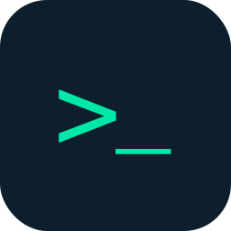

<p align="center">
  
</p>

<h1 align="center">parqet-cli</h1>

<p align="center">
  Query your <a href="https://parqet.com">Parqet</a> portfolio from the command line or from AI agents.
</p>

<p align="center">
  <a href="https://www.npmjs.com/package/parqet-cli"></a>
  <a href="https://www.npmjs.com/package/parqet-cli"></a>
  <a href="LICENSE"></a>
</p>

<p align="center">
  <a href="https://buymeacoffee.com/michaeljauk">
    
  </a>
</p>

---

## Features

- Fetch holdings, performance, and activities for any portfolio
- Multiple output formats: `table`, `json`, `markdown`
- CI-friendly: exit codes, env var overrides, non-interactive mode
- Bundled [Claude Code](https://claude.ai/code) skill — lets AI agents query your portfolio directly

## Installation

```sh
npm install -g parqet-cli
```

Authenticate once after install:

```sh
parqet auth login   # opens browser for OAuth
```

## Commands

```sh
# Portfolios
parqet portfolio list
parqet portfolio show <id>
parqet portfolio show <id> --timeframe 1y

# Holdings
parqet portfolio holdings <id>

# Activities (transactions)
parqet portfolio activities <id>
parqet portfolio activities <id> --limit 50

# Auth
parqet auth login                # authorize via browser
parqet auth login --no-browser   # headless flow: print URL, paste redirect back
parqet auth status               # check token status
parqet auth logout               # remove stored credentials
```

### Headless / remote servers

On machines without a browser (headless Linux, SSH-only boxes), use:

```sh
parqet auth login --no-browser
```

It prints an authorization URL, you open it on any device, and paste the
redirect URL (copied from your browser's address bar — the localhost page
does not need to load) back into the prompt.

### Timeframes

`1d` `1w` `mtd` `1m` `3m` `6m` `1y` `ytd` `3y` `5y` `10y` `max`

## Output formats

Every command accepts `--output table|json|markdown` (default: `table`):

```sh
parqet portfolio list --output json
parqet portfolio holdings <id> --output markdown >> holdings.md
```

In CI environments (`CI=true`), JSON is the default.

## Scripting & agent use

### Exit codes

| Code | Meaning |
|------|---------|
| `0` | Success |
| `1` | Error |
| `2` | Not authenticated — run `parqet auth login` |

### Environment variables

| Variable | Description |
|----------|-------------|
| `PARQET_TOKEN` | Override stored access token (useful in CI) |
| `PARQET_QUIET=1` | Suppress info messages |
| `NO_COLOR=1` | Disable ANSI colors |
| `CI=true` | Non-interactive mode, defaults to JSON output |

Tokens are stored at `~/.config/parqet-cli/tokens.json` (mode 600). If a command exits with code `2`, the token is missing or expired.

### jq examples

```sh
# Current portfolio value
parqet portfolio show <id> --output json | jq '.performance.valuation.atIntervalEnd'

# YTD return in percent
parqet portfolio show <id> --output json | jq '.performance.unrealizedGains.inInterval.returnGross'

# Holdings sorted by current value
parqet portfolio holdings <id> --output json | jq '[.[] | {name: .asset.name, value: .position.currentValue}] | sort_by(-.value)'
```

## Claude Code skill

A Claude Code skill is bundled and auto-installs to `~/.claude/skills/parqet/` on `npm install -g`. No extra setup needed. Use `/parqet` in any Claude Code session to let Claude query your portfolio directly.

## Development

```sh
bun install
bun run generate    # regenerate types from OpenAPI spec
bun run typecheck
bun test
bun run build
```

## License

MIT
